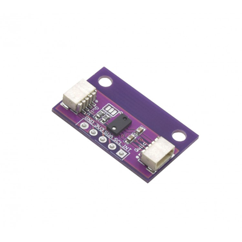

# Qwiic TOF Module (RFD77402)

> This product can be available for purchase [here](https://www.smart-prototyping.com/Zio-TOF-Distance-Sensor-RFD77402.html).

#### Description

In the words of a team member, “kind of dope AF”, this Zio ToF Distance Sensor measures distance faster than the Flash can cover it. If you don’t believe us, you can ask him.

This little board features an RFD77402 time-of-flight rangefinding IC, measuring up to 2m in distance. The sensor uses a vertical-cavity surface-emitting laser (or VCSEL), and measures the time it takes for photons to make the round-trip to the laser’s target, and back to the built-in detector. The laser emitter is class 1, therefore safe for most all applications.

We’ve outfitted the board with mounting holes on wing tabs that can be snapped off to create an even smaller board if you don’t need them. Two Qwiic connectors occupy either side of the breakout board so you can quickly and easily daisy-chain it with other modules. It also includes a standard-pitch header for use with projects that aren’t Qwiic-based.

Apply this sensor in a wide-range of applications such as in robotics for obstacle detection and avoidance, 1D gesture recognition, hand detection, volume or height control, relative position of linear actuators, or for user proximity detection for IoT devices.

Check out this Brick Breaker game that we hacked together using a similar sensor.

#### Specification

* Light Source: VCSEL / 850 nm
* Field of Illumination: 29-degree @ 1/e2
* Field of View: 55-degree @ 1/e2
* Measurement Range: 100-2000mm
* Refresh Rate: 10Hz
* Precision: ±10%
* Laser Eye Safety: Class 1
* Current Consumption: 7-15mA
* IC: RFD77402
* I2C address: 0x4C
* Dimensions: 16.5x 26.3mm (with mounting bar). 26.3x10.5mm (without mounting bar)
* Weight: 1.2g

#### Links

* [RFD77402 Datasheet](https://www.smart-prototyping.com/image/data/NOA-RnD/101891%20TOF/RFD77402DatasheetRev1-8.pdf)
* [SparkFun RFD77402  Library](https://github.com/sparkfun/SparkFun_RFD77402_Arduino_Library)
* [Eagle files](https://github.com/ZIOCC/Qwiic_TOF_Module_RFD77402)

> ###### About Zio
> Zio is a new line of open sourced, compact, and grid layout boards, fully integrated for Arduino and Qwiic ecosystem. Designed ideally for wearables, robotics, small-space limitations or other on the go projects. Check out other awesome Zio products [here](https://www.smart-prototyping.com/Zio).

